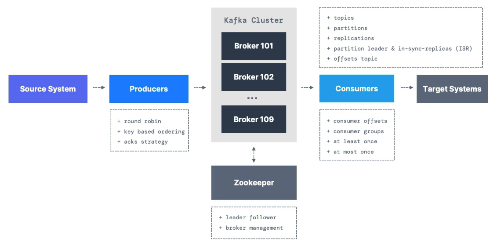

# Introduction

## Types of problems organizations are facing with previous architecture

- If you have _4 source systems_, and _6 target systems_, you need to write _24 integrations_.
- Each integration comes with difficulties:
  - Protocol: how the data is transported (TCP, HTTP, REST, FTP, JDBC...)
  - Data format: how the data is parsed (Binary, CSV, JSON, Avro, Protobuf...)
  - Data schema & evolution: how the data is shaped and may change
- Each source system will have an **increased load** from the connections.

## Why Apache Kaka: Decoupling of data streams and systems

- Source Systems: Website Events, Pricing Data, Financial Transactions and User Interactions.
- Target Systems: Database, Analytics, Email System and Audit.

## Why Apache Kafka

- Distributed, resilient architecture and fault tolerant.
- Horizontal Scalability
  - can scale to 100s of brokers
  - can scale to millions of messages per second
- High performance (latency of less than 10ms) - real time

## Apache Kafka: Use cases

- Kafka is only used as a transportation mechanism.
- Messaging System
- Activity Tracking
- Gather metrics from many different locations
- Application logs gathering
- Stream processing (with the Kafka Streams API for example)
- De-coupling of system dependencies
- Integration with Spark, Flink, Storm, Hadoop, and may other Big Data technologies.
- Microservices pub/sub

---

- Examples:
  - Netflix uses Kafka to apply recommendations in real-time while you are watching TV shows.
  - Uber uses Kafka to gather user, taxi and trip data in real-time to compute and forecast demand, and compute surge pricing in real-time.
  - LinkedIn uses Kafka to prevent spam, collect user interactions to make better connection recommendations in real time.

---