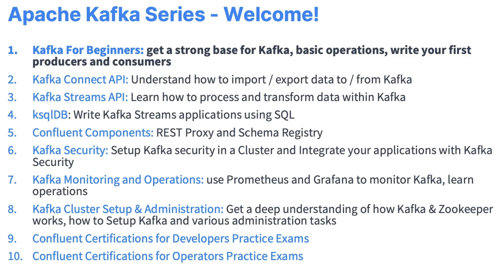

# Course Links

|                 Course Name                 |   Instructor    |                    Course Link                     |
| :-----------------------------------------: | :-------------: | :------------------------------------------------: |
| Udemy - Learn Apache Kafka for Beginners v3 | Stephane Maarek | [Link](https://www.udemy.com/course/apache-kafka/) |

# Apache Kafka with Go

- Use `https://github.com/segmentio/kafka-go` for better stability.
- "github.com/confluentinc/confluent-kafka-go/kafka" introduces cross-compilation issues with C Library (Apache Kafka), setting CGO_ENABLED=1 allows Go to compile properly with C code but it still introduced complications when working with different Operating Systems or architectures.

# Stephane Maarek Udemy Courses

# Extremely Useful Documentations

- [Apache Kafka Confluent Documentation](https://docs.confluent.io/kafka/introduction.html)
- [Apache Kafka with Conduktor Kafkademy](https://learn.conduktor.io/kafka/?fob=TKfV2IfyHyFctX5P)
