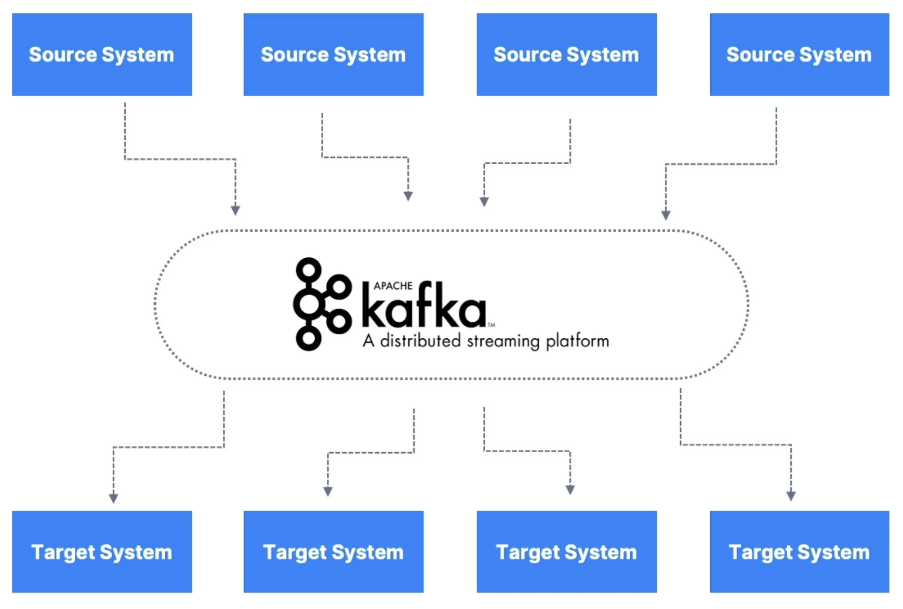
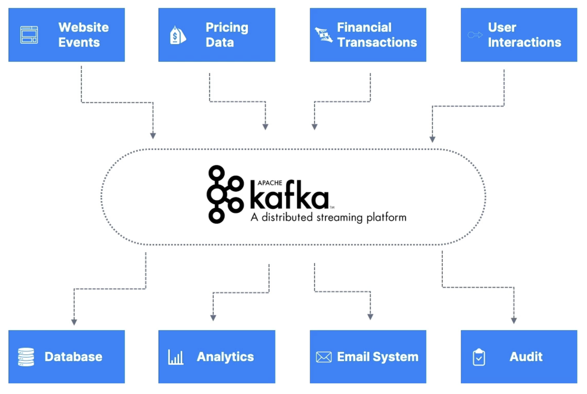
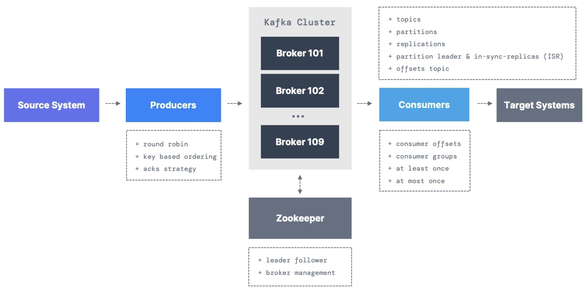

# Kafka Introduction

- Why Apache Kafka?
  - Decoupling of data streams and systems.

- Why Apache Kafka?
  - Distributed, resilient architecture, fault tolerant
  - Horizontal scalability:
    - Can scale to 100s of brokers
    - Can scale to millions of messages per second
  - High performance (latency of less than 10ms) - real time
- Use Cases
  - Messaging system
  - Activity tracking
  - Gather metrics from many different locations
  - Application logs gathering
  - Stream processing (with Kafka Streams API for example)
  - Decoupling of system dependencies
  - Integration with Spark, Flink, Storm, Hadoop and many other Big Data technologies
  - Microservices Pub/Sub
- More examples
  - Netflix uses Kafka to apply recommendations in real-time while you are watching TV shows.
  - Uber uses Kafka to gather user, taxi and trip data in real-time to compute and forecast demand, and compute surge pricing in real-time.
  - LinkedIn uses Kafka to prevent spam, collect user interactions to make better connection recommendations in real time.
- Remember that Kafka is only used as a transportation mechanism.

# References

- [What is Apache Kafka?](https://learn.conduktor.io/kafka/what-is-apache-kafka/)
