# Content

- [Topics, Partitions and Offsets](#topics-partitions-and-offsets)
  - [Topics](#topics)
  - [Partitions and Offsets](#partitions-and-offsets)

# Topics, Partitions and Offsets

## Topics

- Topics: a particular stream of data
- Like a table in a database (without all the constraints)
- You can have as many topics as you want
- A topic is identified by its **name**
  - e.g., `logs`, `purchases`, `twitter_tweets`, `trucks_gps`
- Any kind of message format
- The sequence of messages is called a **data stream**.
- You cannot query topics, instead, use Kafka Producers to send data and Kafka Consumers to read the data.

## Partitions and Offsets

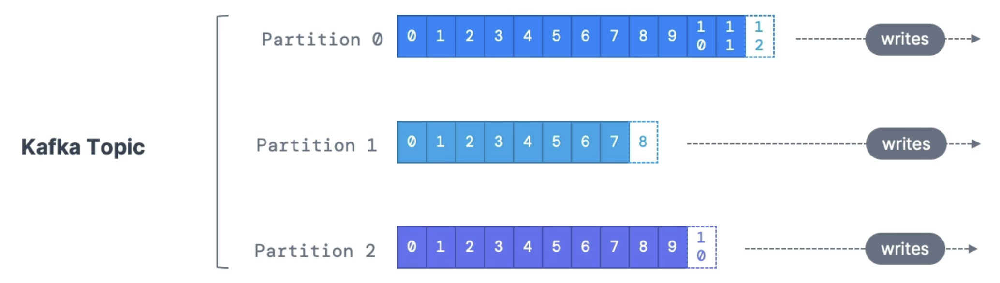

- Topics are split into **partitions** (example: 100 partitions)
  - Messages within each partition are **ordered**
  - Each message within a partition gets an incremental id, called **offset**
- Kafka topics are **immutable**: once data is written to a partition, it cannot be changed.

## Topic Example: `truck_gps`

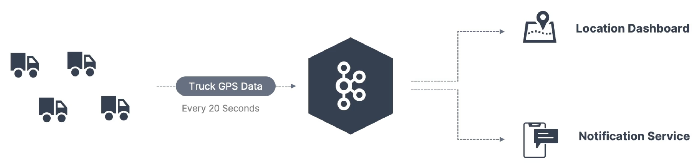

- Say you have a fleet of trucks; each truck reports its GPS position to Kafka.
- Each truck will send a message to Kafka every 20 seconds, each message will contain the truck ID and the truck position (latitude and longitude).
- You can have a topic `trucks_gps` that contains the position of all trucks.
- We choose to create that topic within 10 partitions (arbitrary number)

## Important Notes

- Once the data is written to a partition, **it cannot be changed (immutability)**.
- Data is kept only for a limited time (default is 1 week - configurable).
- Offset only have a meaning for a specific partition.
  - E.g., offset 3 in partition 0 doesn't represent the same data as offset 3 in partition 1
  - Offsets are not re-used even if previous messages have been deleted, just keeps incrementing
- Order is guaranteed only within a partition (not across partitions).
- Data is assigned randomly to a partition unless a key is provided
- You can have as many partitions per topic as you want.

# Producer and Message Keys

## Producers

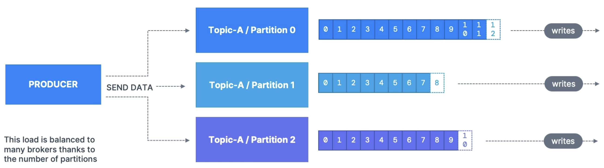

- Producers write data to topics (which are made of partitions).
- Producers know to which partition to write to (and which Kafka broker has it)
- In case of Kafka broker failures, Producers will automatically recover

## Producers: Message Key

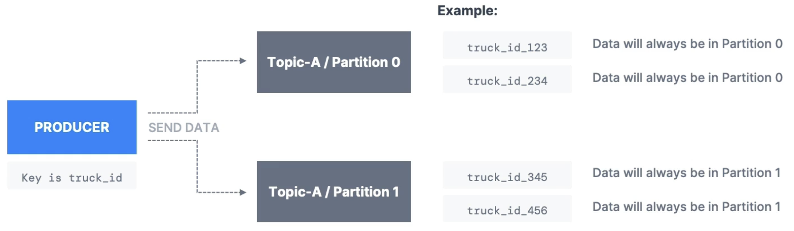

- Producers can choose to send a **key** with the message (string, number, binary, etc ...)
  - If `key == null`, data is sent **round robin** (partition0, then 1, then 2, ...)
  - If `key != null`, then all messages for that key will always go to the same partition (**Hashing**).
- A key is typically sent if you need **message ordering** for a specific field (e.g., `truck_id`).

## Kafka Message anatomy

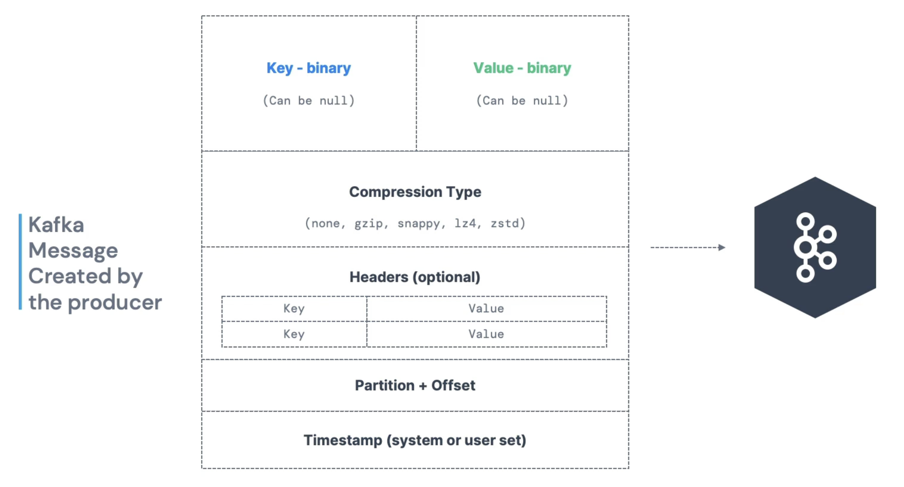

- Can compress message to make them small.

| Field     | Description                                                                                                                                       |
| --------- | ------------------------------------------------------------------------------------------------------------------------------------------------- |
| Key       | Optional identifier used to control **partitioning** and maintain **order**. Same key --> same partition. Often used for grouping (e.g., UserID). |
| Value     | The actual **payload** (can be JSON, Avro, Protobuf, string, binary, etc.). Always **required**.                                                  |
| Headers   | Optional key-value pairs used for **metadata** (e.g., tracing info, content type)                                                                 |
| Timestamp | Create time (set by producer) or Log append time (set by Kafka broker).                                                                           |
| Offset    | Kafka-managed, **monotonically increasing number** per partition. Acts as a cursor for consumers.                                                 |
| Partition | Kafka uses the message key + partitioner to assign each message to a specific partition.                                                          |
| Topic     | Logical grouping of messages. Producers write to, and consumers read from, topics.                                                                |

## Kafka Message Serializer

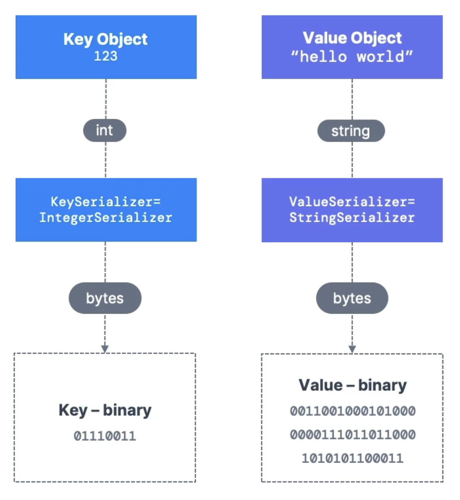

- Kafka only accepts **bytes** as an input from producers and sends bytes out as an output to consumers.
- Message Serialization means transforming objects / data into bytes.
- They are used on the key and the value.
- Common Serializers:
  - String (including JSON)
  - Int, Float
  - Avro
  - Protobuf

## Kafka Message Key Hashing

- **Kafka Partitioner**: code logic that takes a record and determines to which partition to sent it into.

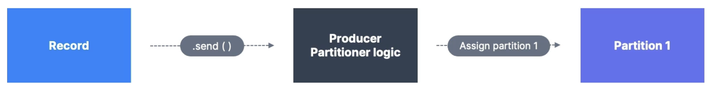

- **Key Hashing** is the process of determining the mapping of a key to a partition.
- In the default Kafka Practitioner, the keys are hashed using the **murmur2 algorithm**, with the formula below:
  - `targetPartition = Math.abs(Utils.murmur2(keyBytes)) % (numPartitions - 1)`

# Consumers and Deserialization

## Consumers

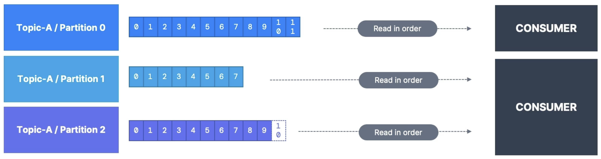

- Consumers read data from a topic (identified by name) - **pull model**
- Consumers automatically know which broker to read from
- In case of broker failures, consumers know how to recover
- Data is read in order from low to high offset **within each partition**.

## Consumer Deserializer

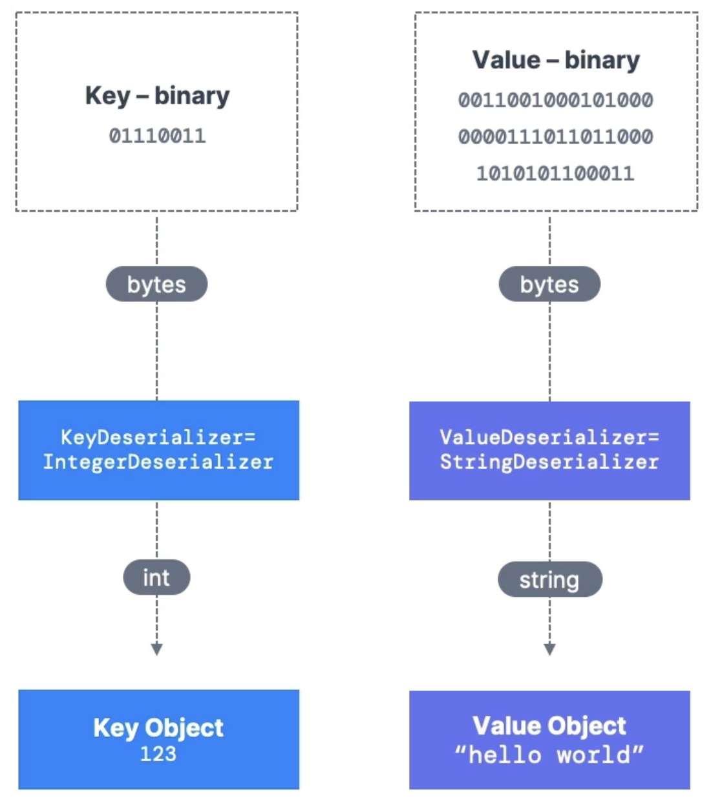

- Deserialize indicates how to transform bytes into objects / data.
- They are used on the key and value of the message.
- Common Deserializers:
  - String (including JSON)
  - Int, Float
  - Avro
  - Protobuf
- The serialization / deserialization type must not change during a topic lifecycle (create a new topic instead).
  - Consumer needs to know in advance whats the expected key and value.
  - Don't change the type of data that is sent by the producers!
  - If you want to change data type of topic, create new topic. Consumers will be re-programmed to read this new format.

# Consumer Groups and Consumer Offsets

## Consumer Groups

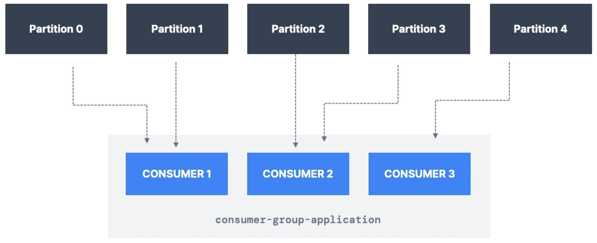

- All the consumers in an application read data as a consumer group.
- Each consumer within a group reads from **exclusive partitions**.

## Consumer Groups - What if too many consumers?

- If you have more consumers than partitions, some consumers will be **inactive**.

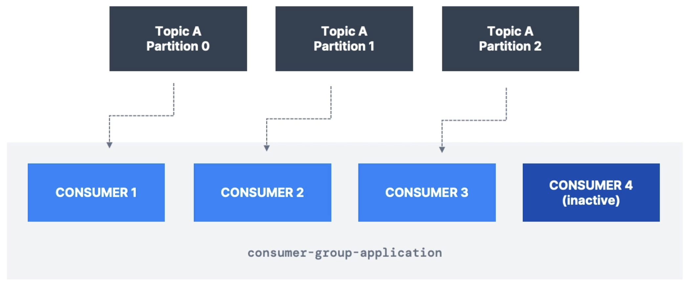

## Multiple Consumers on 1 topic

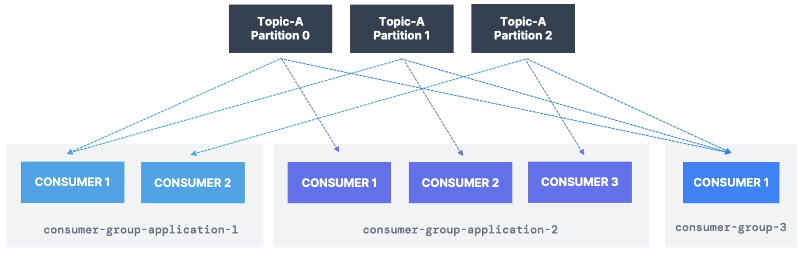

- In Kafka, it is acceptable to have **multiple consumer groups on the same topic**.
  - E.g., in `trucks_gps` topic, 1 consumer group for Location Service and 1 consumer group for Notifications Service.
- To create distinct consumer groups, use the consumer property `group.id`

## Consumer Offsets

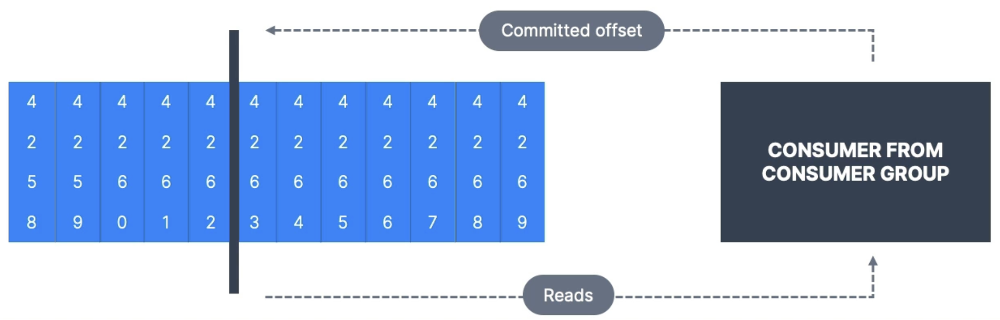

- Kafka stores the offsets at which a consumer group has been reading, allowing multiple independent groups to consume the same topic differently.
- The offsets committed are in an internal Kafka **topic** named `__consumer_offsets`.
- When a consumer in a group has processed data received from Kafka, it should be **periodically** committing the offsets (the Kafka broker will write to `__consumer_offsets`, not the group itself).
- Offset commit strategies:
  - **Automatic** (`enable.auto.commit = true`) - Kafka commits periodically.
  - **Manual** - You control when offsets are committed (safer in most real apps).
- If a consumer dies, it will be able to read back from where it left off thanks to the committed consumer offsets.

## Delivery Semantics for Consumers

- By default, Java Consumers will automatically commit offsets (at least once)
- There are 3 delivery semantics if you choose to **commit manually**:
  1. **At Least Once** (Default in Kafka)
  - Definition: A message is delivered **one or more times**, it won't be lost, but it might be duplicated.
  - How? Offset is **committed after processing**.
  - Risk: If the consumer crashed after processing but before committing, the message is processed again after recovery.
    - This can result in duplicate processing of messages. Make sure your processing is **idempotent** (i.e., processing the messages again won't impact your systems).
  - Most common; trades duplication for durability.
  2. **At Most Once**
  - Definition: A message is delivered **zero or one time**, it may be lost but never duplicated.
  - How? Offset is **committed before message processing**.
  - Risk: If the consumer crashes after committing the offset but before processing, that message is lost.
  - Safe but not reliable for critical data.
  3. **Exactly Once**
  - Definition: A message is delivered **exactly once**, no duplicates, no loss.
    - Messages are never lost or read twice even if some part of the system fails.
  - How? Requires:
    - Kafka 0.11+
    - **Idempotent producers**
    - **Transactional APIs** (`enable.idempotence=true` on producer)
    - `read_process_commit` within a single Kafka transaction.
  - Risk: Higher complexity, performance cost.
  - Ideal for financial systems, stateful processing, or data pipelines where duplicates cause errors.

# Brokers and Topics

## Kafka Brokers

- A Kafka cluster is composed of multiple brokers (servers).
- Each broker is identified with its ID (integer).
- Each broker contains certain topic partitions.
- After connecting to any broker (called a bootstrap broker), you will be connected to the entire cluster (Kafka clients have smart mechanics for that).
- A good number to get started is 3 brokers, but some big clusters have over 100 brokers.
- To produce data to a topic, a producer must provide the Kafka client with any broker from the cluster and the topic name.
  - You only need to connect to one broker (any broker) and just provide the topic name you want to write to.
  - Kafka Clients will route your data to the appropriate brokers and partitions for you.
  - Same for consuming data, just provide any broker in cluster and the topic name.

## Example: Brokers and Topics

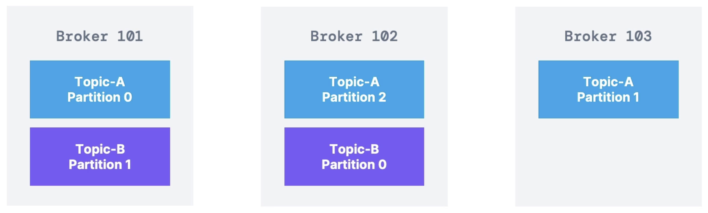

- Example:
  - Topic-A with 3 partitions
  - Topic-B with 2 partitions
- Note: Data is distributed, and Broker 103 doesn't have any Topic B data.
- **Horizontal Scaling** in Kafka:
  - Distributing partitions of topics across multiple brokers to spread load and increase throughput.
  - Each partition can be seen as a unit of parallelism, and each broker stores some partitions.

## Kafka Broker Discovery

- Every Kafka broker is also called a **bootstrap server**.
- That means that **you only need to connect to 1 broker**, and the Kafka clients will know how to be connected to the entire cluster (smart clients).
- Each broker knows about all brokers, topics and partitions (metadata).

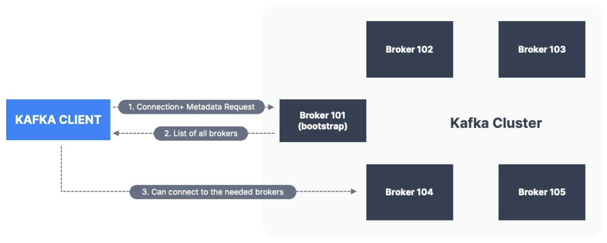

# Topic Replication

## Topic Replication Factor

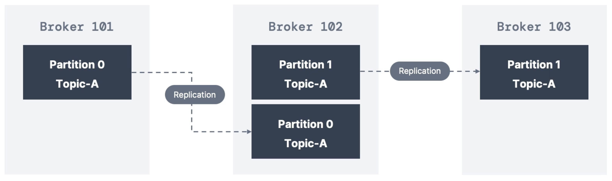

- Topics should have a replication factor > 1 (usually between 2 and 3).
- This way if a broker is down, another broker can serve the data.
- Example: Topic-A with 2 partitions and replication factor of 2.

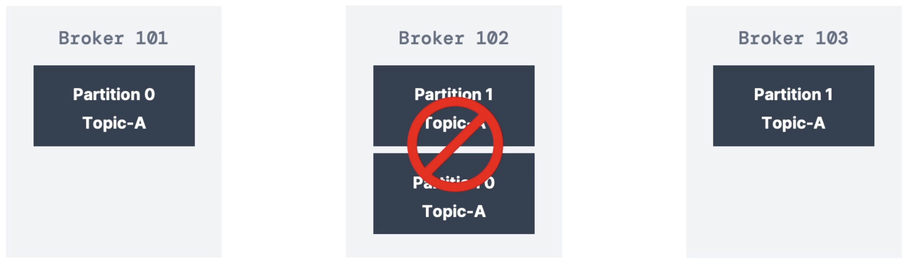

- Example: we lose Broker 102
- Result: Broker 101 and 103 can still serve data.
- Replication factor of 2 means only 1 broker can be down at a time.

## Concept of Leader for a Partition

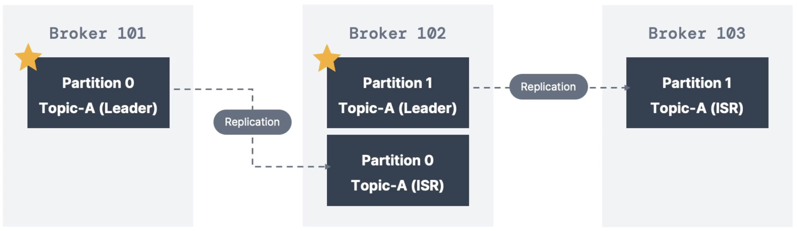

- **At any time, only ONE broker can be a leader for a given partition**.
- **Producers can only send data to the broker that is leader of a partition**.
- The other brokers will replicate the data.
- Therefore, each partition has one leader and multiple ISR (in-sync replica).
  - **ISR**: a set of brokers that have **replicated all data** from the leader **up to the latest committed offset**.
  - **Out-of-Sync**: Replica lagging behind, removed from ISR.
  - Run `kafka-topics.sh --describe` to view leader and ISR

## Default Producer and Consumer behavior with Leaders

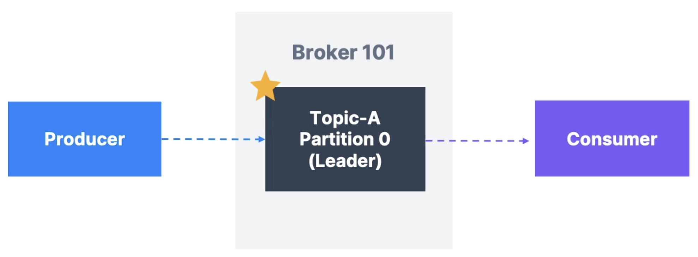

- Kafka Producers can only write to the leader broker for a partition.
- Kafka Consumers by default will read from the leader broker for a partition.

## Kafka Consumers Replica Fetching (Kafka v2.4+)

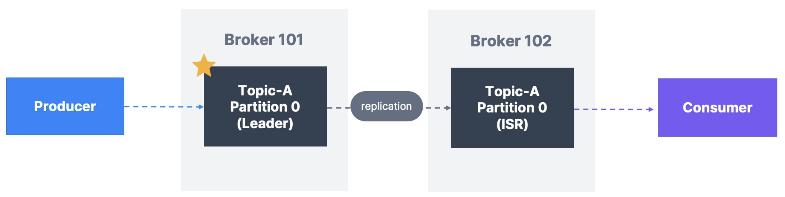

- Since Kafka 2.4, it is possible to configure consumers to read from the closest replica.
- This may help improve latency, and also decrease network costs if using the cloud.

# Producer Acknowledgements and Topic Durability

## Producer Acknowledgements (acks)

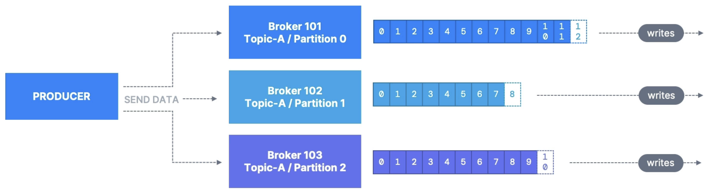

- Producers can choose to receive acknowledgement of data writes:
  - `acks=0`: Producer won't wait for acknowledgement (possible data loss)
  - `acks=1`: Producer will wait for leader acknowledgement (limited data loss)
  - `acks=all`: Leader + Replicas acknowledgement (no data loss)

## Kafka Topic Durability

- For a topic replication factor of 3, topic data durability can withstand 2 broker loss.
- As a rule, for a replication factor of `N`, you can permanently lose up to `N-1` brokers and still recover your data.

# Zookeeper

- Zookeeper manages brokers (keeps a list of them)
- Zookeeper helps in performing leader election for partitions (whenever kafka broker goes down)
- Zookeeper sends notifications to Kafka in case of changes (e.g., new topic, broker dies, broker comes up, delete topics, etc...)
- **Kafka 2.x**: can't work without Zookeeper
- **Kafka 3.x**: can work without Zookeeper (KIP-500) - using Kafka Raft instead
- **Kafka 4.x**: will not have Zookeeper
- Zookeeper by design operates with an odd number of servers (1, 3, 5, 7)
- Zookeeper has a leader (writes), the rest of the servers are followers (reads).
- Zookeeper does NOT store consumer offsets with Kafka v0.10, consumer offsets are now stored in topic called `__consumer_offsets`

## Zookeeper Cluster (ensemble)

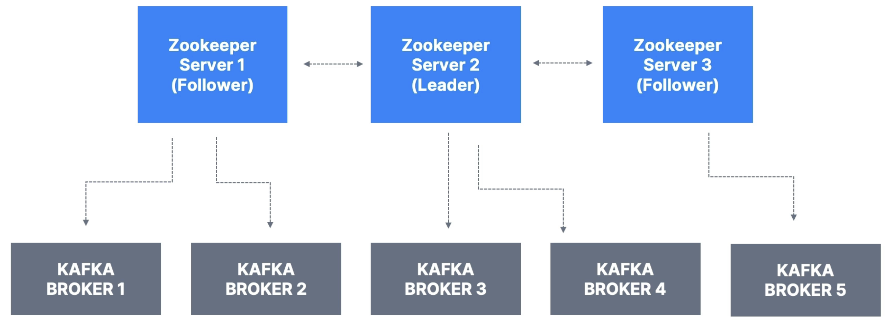

## Should you use Zookeeper?

- With Kafka brokers?
  - Yes, until Kafka 4.0 is out while waiting for Kafka without Zookeeper to be production-ready.
- With Kafka clients?
  - Over time, the Kafka clients and CLI have been migrated to leverage the brokers as a connection endpoint instead of Zookeeper.
  - Starting with Kafka v0.10, consumer offset storage in Kafka became the default (instead of Zookeeper). While older consumers could still
    use Zookeeper for offset management, modern consumers must not connect to Zookeeper directly, as direct Zookeeper access by clients is deprecated and
    will be removed in future Kafka versions.
  - Since Kafka 2.2, the `kafka-topics.sh` CLI command references Kafka brokers and not Zookeeper for topic management (creation, deletion, etc...) and
    the Zookeeper CLI argument is deprecated.
  - All the APIs and commands that were previously leveraging Zookeeper are migrated to use Kafka instead, so that when clusters are migrated to be without
    Zookeeper, the change is invisible to clients.
  - Zookeeper is also less secure than Kafka, and therefore Zookeeper ports should only be opened to allow traffic from Kafka brokers, and not Kafka clients.
  - **Therefore, to be a great modern-day Kafka developer, never use Zookeeper as a configuration in your Kafka clients, and other programs that connect to Kafka.**

# Kafka KRaft - Removing Zookeeper

## About Kafka KRaft

- In 2020, the Apache Kafka project started to work to remove the Zookeeper dependency from it (KIP-500).
- Zookeeper shows scaling issues when Kafka clusters have > 100,000 partitions.
- By removing Zookeeper, Apache Kafka can:
  - Scale to millions of partitions, and becomes easier to maintain and set-up.
  - Improve stability, makes it easier to monitor, support and administer.
  - Single security model for the whole system.
  - Single process to start with Kafka.
  - Faster controller shutdown and recovery time.
- Kafka 3.X now implements the Raft protocol (KRaft) in order to replace Zookeeper.
  - Production ready since Kafka 3.3.1 (KIP-833)
  - Kafka 4.0 will be released only with KRaft (no Zookeeper)

## Kafka KRaft Architecture

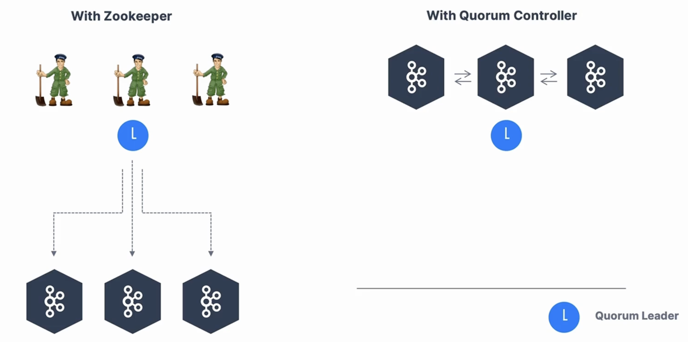

## KRaft Performance Improvements

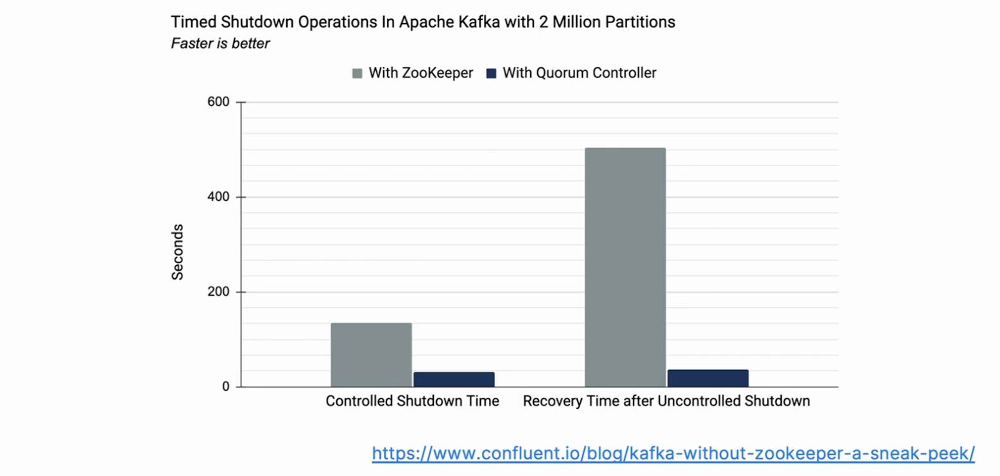

