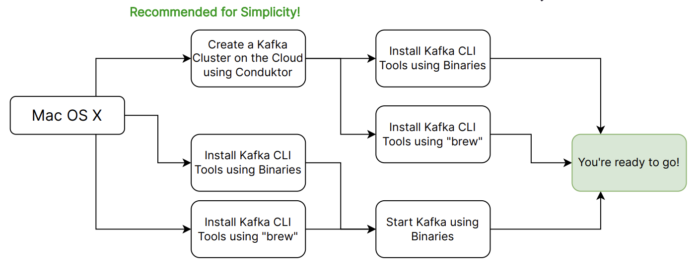
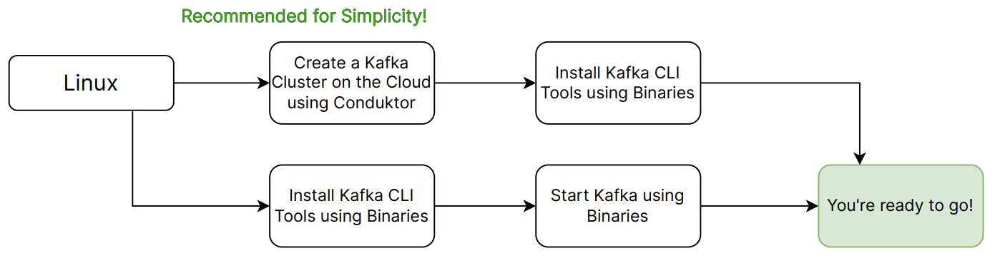
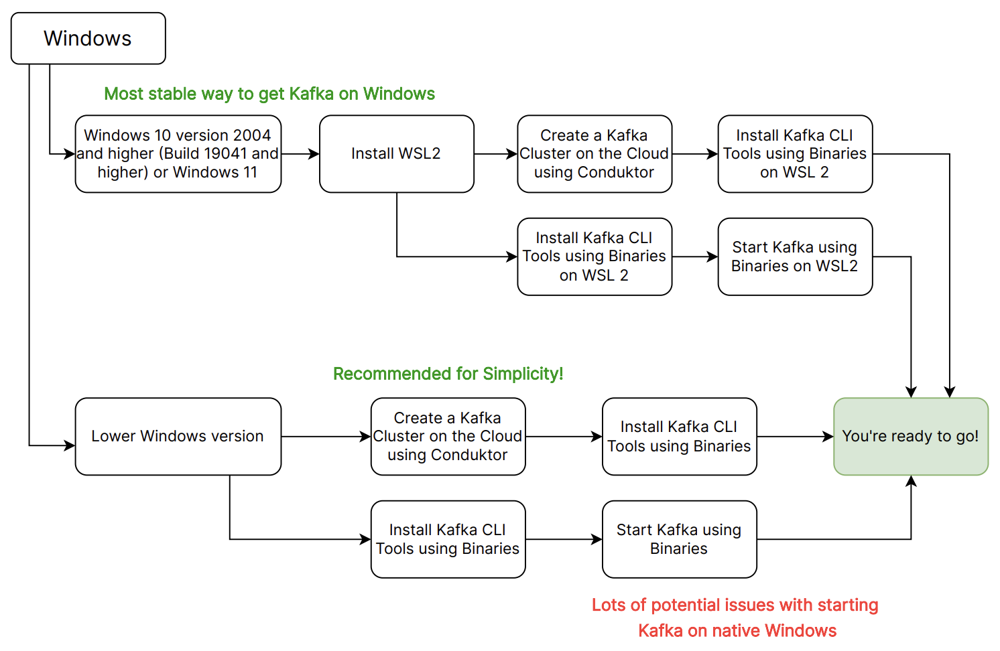

# Content

# Kafka Installation Steps

- [Starting Kafka](https://www.conduktor.io/kafka/starting-kafka)

## MacOS

- [Using brew to install kafka](https://learn.conduktor.io/kafka/how-to-install-apache-kafka-on-mac-with-homebrew/)
- `brew install kafka`
- Or just run `make docker_kafka`

## Linux

## Windows

