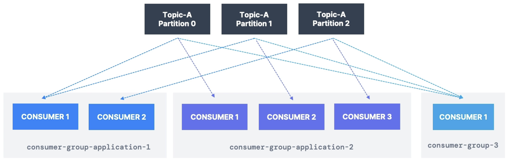

# Content

- [Base Config File](#base-config-file)
- [Kafka Topics CLI](#kafka-topics-cli-kafka-topics)
- [Kafka Console Producer CLI](#kafka-console-producer-cli-kafka-console-producer)
- [Kafka Console Consumer CLI](#kafka-console-consumer-cli-kafka-console-consumer)
- [Kafka Consumers in Group](#kafka-consumers-in-group)
- [Kafka Consumer Group](#kafka-consumer-group-kafka-consumer-groups)
- [Resetting Offsets](#resetting-offsets)

# Base Config File

- Create a `.config` file and add tag `--command-config` in Kafka CLI commands.

```sh
# Create your playground.config file with content such as
security.protocol=SASL_SSL
sasl.jaas.config=org.apache.kafka.common.security.plain.PlainLoginModule required username="<your username>" password="<your password>";
sasl.mechanism=PLAIN
```

# Kafka Topics CLI (`kafka-topics`)

- Create Kafka Topics
- List Kafka Topics
- Describe Kafka Topics
- Increase Partitions in a Kafka Topic
- Delete a Kafka Topic

```sh
# Create Kafka Topic called `my_topic`
kafka-topics --bootstrap-server localhost:9092 --topic my_topic --create

# Create Kafka Topic with 3 partitions
kafka-topics --bootstrap-server localhost:9092 --topic my_topic --create --partitions 3

# Create Kafka Topic with 3 partitions and Replication Factor of 2
# Fails on localhost because there is only 1 broker on localhost so we can't replicate partitions
kafka-topics --bootstrap-server localhost:9092 --topic my_topic --create --partitions 3 --replication-factor 2

# Describe a Kafka Topic
kafka-topics --bootstrap-server localhost:9092 --topic my_topic --describe

# Delete a Kafka Topic (only works if delete.topic.enable=true)
kafka-topics --bootstrap-server localhost:9092 --topic my_topic --delete

# List Kafka Topics
kafka-topics --bootstrap-server localhost:9092 --list
```

# Kafka Console Producer CLI (`kafka-console-producer`)

- Produce without keys
- Produce with keys

```sh
# Producing to Kafka Topic (Ctrl + C to exit the producer)
kafka-console-producer --bootstrap-server localhost:9092 --topic my_topic
# >Message One
# >Message Two
# >Updating Status

# Producing with properties (acks)
kafka-console-producer --bootstrap-server localhost:9092 --topic my_topic --producer-property acks=all

# Producing to a topic that doesn't exist
# If `auto.create.topics.enable=true` (default in many setups), topic is automatically created
# with default broker settings of 1 partition and replication factor of 1. Can edit the default
# settings in config/server.properties or config/kraft/server.properties, set `num.partitions=3`
# If `auto.create.topics.enable=false`, will see UnknownTopicOrPartitionException error.
kafka-console-producer --bootstrap-server localhost:9092 --topic new_topic

# Producing with keys
kafka-console-producer --bootstrap-server localhost:9092 --topic my_topic --property parse.key=true --property key.separator=:
# >name:leon
# >name:darrel
```

# Kafka Console Consumer CLI (`kafka-console-consumer`)

- Consume from tail of the topic (new messages)
- Consume from beginning of the topic
- Show both key and values in the output

```sh
# Consuming from Kafka Topic
# This consumer is in a new anonymous consumer group because `--group` not specified.
kafka-console-consumer --bootstrap-server localhost:9092 --topic my_topic

# Consuming from Kafka Topic, from the beginning (to consume message from offset 0)
# If multiple partitions, output is not in order
# If only 1 partition, output will be in order
kafka-console-consumer --bootstrap-server localhost:9092 --topic my_topic --from-beginning

# Consume while displaying key, value and timestamp in consumer
kafka-console-consumer --bootstrap-server localhost:9092 --topic my_topic --formatter kafka.tools.DefaultMessageFormatter --property print.timestamp=true --property print.key=true --property print.value=true --property print.partition=true --from-beginning
```

- Let's try with an example

```sh
# 1. Create Topic
kafka-topics --bootstrap-server localhost:9092 --topic my_topic --create --partitions 3

# 2. Create Producer (with round robin balancer, don't use this balancer in production)
kafka-console-producer --bootstrap-server localhost:9092 --producer-property partitioner.class=org.apache.kafka.clients.producer.RoundRobinPartitioner --topic my_topic
# >Hello
# >Leon
# >Message One
# >Message Two

# 3. Create Consumer
kafka-console-consumer --bootstrap-server localhost:9092 --topic my_topic
# Hello
# Leon
# Message One
# Message Two

# 4. Create Consumer (different consumer group)
# Messages not in order because there are 3 partitions
kafka-console-consumer --bootstrap-server localhost:9092 --topic my_topic --from-beginning
# Leon
# Message Two
# Hello
# Message One
```

# Kafka Consumers in Group

<p align="center">

</p>

- `--group` parameter
- See how partitions read are divided amongst multiple CLI consumers.

```sh
# Create a topic with 3 partitions
kafka-topics --bootstrap-server localhost:9092 --topic my_topic --create --partitions 3

# Start a consumer in group 'my-first-group'
kafka-console-consumer --bootstrap-server localhost:9092 --topic my_topic --group my-first-group

# Start a producer using round-robin partitioner
kafka-console-producer --bootstrap-server localhost:9092 --producer-property partitioner.class=org.apache.kafka.clients.producer.RoundRobinPartitioner --topic my_topic

# Start a second consumer in the same group (to observe load balancing)
kafka-console-consumer --bootstrap-server localhost:9092 --topic my_topic --group my-first-group

# Start a third consumer in a different group, read from beginning
kafka-console-consumer --bootstrap-server localhost:9092 --topic my_topic --group my-second-group --from-beginning
```

# Kafka Consumer Group (`kafka-consumer-groups`)

<p align="center">

</p>

- List consumer groups
- Describe one consumer group
- Delete a consumer group

```sh
# List Consumer Groups
kafka-consumer-groups --bootstrap-server localhost:9092 --list

# Describe a consumer group
kafka-consumer-groups --bootstrap-server localhost:9092 --describe --group my-first-group
```

- Let's try with an example to study `LAG` property

```sh
# 1. Create topic
kafka-topics --bootstrap-server localhost:9092 --topic my_topic --create --partitions 3

# 2. Create Consumer Group
kafka-console-consumer --bootstrap-server localhost:9092 --topic my_topic --group my-first-group

# 3. Create Producer and produce messages
kafka-console-producer --bootstrap-server localhost:9092 --producer-property partitioner.class=org.apache.kafka.clients.producer.RoundRobinPartitioner --topic my_topic
# >Hello
# >Message 1
# >Message 2
# >...

# 4. Stop the Consumer Group
# CTRL + C

# 5. Describe the consumer group
kafka-consumer-groups --bootstrap-server localhost:9092 --describe --group my-first-group
# GROUP           TOPIC           PARTITION  CURRENT-OFFSET  LOG-END-OFFSET  LAG             CONSUMER-ID     HOST            CLIENT-ID
# my-first-group  my_topic        0          53              53              0               -               -               -
# my-first-group  my_topic        1          13              13              0               -               -               -
# my-first-group  my_topic        2          14              14              0               -               -               -

# 6. Create Producer and produce messages, this time no consumer to consume messages
kafka-console-producer --bootstrap-server localhost:9092 --producer-property partitioner.class=org.apache.kafka.clients.producer.RoundRobinPartitioner --topic my_topic

# 7. Describe the consumer group, notice LAG is >0, means there are messages that are not consumed yet
kafka-consumer-groups --bootstrap-server localhost:9092 --describe --group my-first-group
GROUP           TOPIC           PARTITION  CURRENT-OFFSET  LOG-END-OFFSET  LAG             CONSUMER-ID     HOST            CLIENT-ID
my-first-group  my_topic        0          53              55              2               -               -               -
my-first-group  my_topic        1          13              16              3               -               -               -
my-first-group  my_topic        2          14              17              3               -               -               -
```

- Another example where CONSUMER-ID is different.

```sh
# 1. Start 2 consumers in a consumer group in different terminals
kafka-console-consumer --bootstrap-server localhost:9092 --topic my_topic --group my-first-group
kafka-console-consumer --bootstrap-server localhost:9092 --topic my_topic --group my-first-group

# 2. Describe the consumer group
# You may notice two CONSUMER-IDs listed, for example:
#   - console-consumer-7c78c21a-0420-45ef-8a5a-0e352649551b (handling 2 partitions)
#   - console-consumer-b9e25182-cb7d-40ad-8830-8bcad61b8c1f (handling 1 partition)
#
# This happens because:
#   - The topic `my_topic` has 3 partitions.
#   - There are 2 consumers in the same group (`my-first-group`), so Kafka balances the partitions between them.
#   - One consumer is assigned **2 partitions** (e.g., partition 0 and 1).
#   - The other consumer is assigned **1 partition** (e.g., partition 2).
#
# The CONSUMER-ID is a unique identifier for each consumer instance.
# If two consumers show the same CONSUMER-ID, it's likely the same process or terminal accidentally ran twice,
# but in this correct output, the CONSUMER-IDs are **different**, as expected.

kafka-consumer-groups --bootstrap-server localhost:9092 --describe --group my-first-group

# GROUP           TOPIC           PARTITION  CURRENT-OFFSET  LOG-END-OFFSET  LAG             CONSUMER-ID                                           HOST            CLIENT-ID
# my-first-group  my_topic        0          0               0               0               console-consumer-7c78c21a-0420-45ef-8a5a-0e352649551b /127.0.0.1      console-consumer
# my-first-group  my_topic        1          0               0               0               console-consumer-7c78c21a-0420-45ef-8a5a-0e352649551b /127.0.0.1      console-consumer
# my-first-group  my_topic        2          0               0               0               console-consumer-b9e25182-cb7d-40ad-8830-8bcad61b8c1f /127.0.0.1      console-consumer
```

# Resetting Offsets

<p align="center">

</p>

- Start / Stop console consumer
- Reset offsets (can only reset when all consumers are not running)
- Start console consumer and see the outcome

```sh
# Dry Run: Reset the offsets to the beginning of each partition
# Dry run is to check if everything is okay, not running actual command yet
kafka-consumer-groups --bootstrap-server localhost:9092 --group my-first-group --reset-offsets --to-earliest --topic my_topic --dry-run

# --execute actually executes the command to reset offset
kafka-consumer-groups --bootstrap-server localhost:9092 --group my-first-group --reset-offsets --to-earliest --topic my_topic --execute
```

- An example

```sh
# 1. Describe Consumer Group
kafka-consumer-groups --bootstrap-server localhost:9092 --describe --group my-first-group
# GROUP           TOPIC           PARTITION  CURRENT-OFFSET  LOG-END-OFFSET  LAG             CONSUMER-ID     HOST            CLIENT-ID
# my-first-group  my_topic        0          4               4               0               -               -               -
# my-first-group  my_topic        1          6               6               0               -               -               -
# my-first-group  my_topic        2          1               1               0               -               -               -

# 2. Dry Run: Reset offset
kafka-consumer-groups --bootstrap-server localhost:9092 --group my-first-group --reset-offsets --to-earliest --topic my_topic --dry-run
# GROUP                          TOPIC                          PARTITION  NEW-OFFSET
# my-first-group                 my_topic                       0          0
# my-first-group                 my_topic                       1          0
# my-first-group                 my_topic                       2          0

# 3. Reset offset
kafka-consumer-groups --bootstrap-server localhost:9092 --group my-first-group --reset-offsets --to-earliest --topic my_topic --execute

# 4. Describe consumer group
# Notice that LAG > 0 because we reset offset to the beginning
kafka-consumer-groups --bootstrap-server localhost:9092 --describe --group my-first-group
# GROUP           TOPIC           PARTITION  CURRENT-OFFSET  LOG-END-OFFSET  LAG             CONSUMER-ID     HOST            CLIENT-ID
# my-first-group  my_topic        0          0               4               4               -               -               -
# my-first-group  my_topic        1          0               6               6               -               -               -
# my-first-group  my_topic        2          0               1               1               -               -               -

# 5. Start consumer group to consume messages
kafka-console-consumer --bootstrap-server localhost:9092 --topic my_topic --group my-first-group

# 6. Describe consumer group
# This time LAG is all 0 because we consumed the messages
kafka-consumer-groups --bootstrap-server localhost:9092 --describe --group my-first-group
# GROUP           TOPIC           PARTITION  CURRENT-OFFSET  LOG-END-OFFSET  LAG             CONSUMER-ID                                           HOST            CLIENT-ID
# my-first-group  my_topic        0          4               4               0               console-consumer-09cadde2-e04a-43d4-a65a-a0ebc8b78ba4 /127.0.0.1      console-consumer
# my-first-group  my_topic        1          6               6               0               console-consumer-09cadde2-e04a-43d4-a65a-a0ebc8b78ba4 /127.0.0.1      console-consumer
# my-first-group  my_topic        2          1               1               0               console-consumer-09cadde2-e04a-43d4-a65a-a0ebc8b78ba4 /127.0.0.1      console-consumer
```
