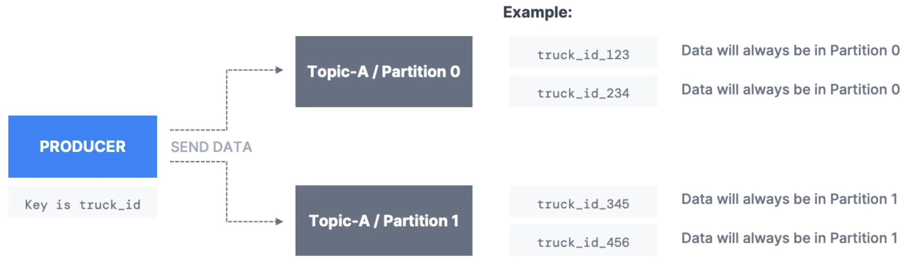
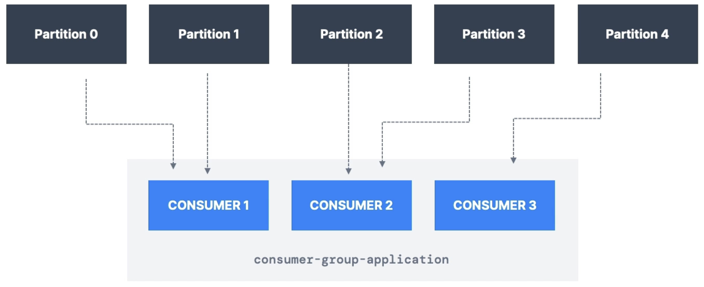

# Content

# SDK List for Kafka

- The official SDK for Apache Kafka is the Java SDK
- For other languages, it's community supported:
  - Scala, C, C++, Golang, Python, JavaScript, .NET, C#, ...
  - List of recommended SDK at https://learn.conduktor.io/kafka/kafka-sdk-list/
- In this course, we will only do Java programming for Apache Kafka
- Basic knowledge of Java is necessary

# Kafka Producer

- Learn how to write a basic producer to send data to Kafka.
- View basic configuration parameters
- Confirm we receive the data in a Kafka Console Consumer

```sh
# Create the topic
kafka-topics --bootstrap-server localhost:9092 --topic demo_java --create --partitions 3

# Consume message
kafka-console-consumer --bootstrap-server localhost:9092 --topic demo_java --from-beginning
# hello world
```

# Kafka Producer: Java API (Callbacks)

- Confirm the partition and offset the message was sent to using Callbacks
- `StickyPartitioner`: performance improvement
  - When a bulk of messages are sent quickly, the producer is smart enough to batch these messages are send to 1 partition instead of round robin.

<p align="center">

</p>

```java
producer.send(record, new Callback() {
    @Override
    public void onCompletion(RecordMetadata metadata, Exception e) {
        // Executes every time a record is successfully sent or an exception is thrown
        if (e == null) {
            // Record was successfully sent
            log.info("Topic: {}, Partition: {}, Offset: {}, Timestamp: {}",
                    metadata.topic(), metadata.partition(), metadata.offset(), metadata.timestamp());
        } else {
            log.error("Error while producing", e);
        }
    }
});
// ProducerWithCallback - Topic: demo_java, Partition: 0, Offset: 10, Timestamp: 1752986530940
```

# Kafka Producer: Java API (with Keys)

- Send non-null keys to the Kafka topic.
- Same key = same partition

<p align="center">

</p>

```sh
# Output:
# Keys that are the same go to the same partition
INFO ProducerWithKeys - Key: id_1, Partition: 0
INFO ProducerWithKeys - Key: id_3, Partition: 0
INFO ProducerWithKeys - Key: id_6, Partition: 0
INFO ProducerWithKeys - Key: id_0, Partition: 1
INFO ProducerWithKeys - Key: id_8, Partition: 1
INFO ProducerWithKeys - Key: id_2, Partition: 2
INFO ProducerWithKeys - Key: id_4, Partition: 2
INFO ProducerWithKeys - Key: id_5, Partition: 2
INFO ProducerWithKeys - Key: id_7, Partition: 2
INFO ProducerWithKeys - Key: id_9, Partition: 2
INFO ProducerWithKeys - Key: id_1, Partition: 0
INFO ProducerWithKeys - Key: id_3, Partition: 0
INFO ProducerWithKeys - Key: id_6, Partition: 0
INFO ProducerWithKeys - Key: id_0, Partition: 1
INFO ProducerWithKeys - Key: id_8, Partition: 1
INFO ProducerWithKeys - Key: id_2, Partition: 2
INFO ProducerWithKeys - Key: id_4, Partition: 2
INFO ProducerWithKeys - Key: id_5, Partition: 2
INFO ProducerWithKeys - Key: id_7, Partition: 2
INFO ProducerWithKeys - Key: id_9, Partition: 2
```

# Kafka Consumer: Java API (Basics)

<p align="center">

</p>

- Write a basic consumer to receive data from Kafka.
- View basic configuration parameters
- Confirm we receive the data from the Kafka Producer written in Java

```java
// Consumer Group
properties.setProperty("group.id", groupId);

// Reset offset
// 3 values - none, earliest, latest
// none: no existing consumer group, fail
// earliest: read from beginning of topic, like `--from-beginning`
// latest: only read from new messages sent from now
properties.setProperty("auto.offset.reset", "earliest");
```

# Kafka Consumer: Graceful Shutdown

- Ensure we have code in place to respond to termination signals
- Properly shutdown consumer so when it rejoins, it can read offsets quickly and retrieve messages from broker.

```java
// Get a reference to the main thread
final Thread mainThread = Thread.currentThread();

// Add the shutdown hook
Runtime.getRuntime().addShutdownHook(new Thread(() -> {
    log.info("Detected a shutdown, let's exit by calling consumer.wakeup()");
    consumer.wakeup(); // throws Wakeup Exception at consumer.poll() in while loop

    // Join the main thread to allow the execution of the code in the main thread
    try {
        mainThread.join();
    } catch (InterruptedException e) {}
}));
```

```java
// Handling WakeupException
} catch (WakeupException e) {
    log.info("Consumer is starting to shut down");
} catch (Exception e) {
    log.error("Unexpected exception in the consumer", e);
} finally {
    consumer.close(); // close the consumer, this will also commit offsets
    log.info("The consumer is now gracefully shut down");
}
```

# Kafka Consumer: Java API (Consumer Groups)

<p align="center">

</p>

- Make your consumer in Java consume data as part of a consumer group
- Observe **partition rebalance** mechanisms.

```sh
# 2 Consumers in the same consumer group with 3 partition
# Consumer 1 logs
Adding newly assigned partitions: demo_java-0, demo_java-1

# Consumer 2 logs
Adding newly assigned partitions: demo_java-2
```

```sh
# 3 Consumers in the same consumer group with 3 partition
# This causes rebalancing of partitions to consumers

# Consumer 1 logs
Adding newly assigned partitions: demo_java-1

# Consumer 2 logs
Adding newly assigned partitions: demo_java-2

# Consumer 3 logs
Adding newly assigned partitions: demo_java-0
```

- With graceful shutdown, when a consumer in consumer group shuts down, the other running consumers in the group will rebalance with the partitions.

# Consumer Groups and Partition Rebalance

<p align="center">

</p>

- Moving partitions between consumers is called a rebalance.
- Reassignment of partitions happen when a consumer leaves or joins a group.
- It also happens if an administrator adds new partitions into a topic.

## Eager Rebalance (default behavior)

- All consumers stop, giving up their membership of partitions.
- They rejoin the consumer group and get a new partition assignment.
- During a short period of time, the entire consumer group stops processing.
- Consumers don't necessarily "get back" the same partitions as they used to.

<p align="center">

</p>

## Cooperative Rebalance (Incremental Rebalance)

- Reassigning a small subset of the partitions from one consumer to another.
- Other consumers that don't have reassigned partitions can still process uninterrupted.
- Can go through several iterations to find a "stable" assignment (hence "incremental").
- Avoids "stop-the-world" events where all consumers stop processing data.

<p align="center">

</p>

## Partition Assignment Strategies

- **Kafka Consumer**: `partition.assignment.strategy`
- Eager Rebalance
  - `RangeAssignor`: assign partitions on a per-topic basis (can lead to imbalance)
  - `RoundRobin`: assign partitions across all topics in round-robin fashion, optimal balance.
  - `StickyAssignor`: balanced like `RoundRobin`, and then minimizes partition movements when consumer join/leave the group in order to minimize movements.
- Cooperative Rebalance
  - `CooperativeStickyAssignor`: rebalance strategy is identical to `StickyAssignor` but supports cooperative rebalance and therefore consumers can keep on consuming from the topic.
- Default Assignor in Kafka 3
  - `[RangeAssignor, CooperativeStickyAssignor]`: which will use the `RangeAssignor` by default, but allows upgrading to the
    `CooperativeStickyAssignor` with just a single rolling bounce that removes the `RangeAssignor` from the list.
- **Kafka Connect**: already implemented (enabled by default)
- **Kafka Streams**: turned on by default using `StreamsPartitionAssignor`.

```java
properties.setProperty("partition.assignment.strategy", CooperativeStickyAssignor.class.getName());
```

## Static Group Membership

<p align="center">

</p>

- By default, when a consumer leaves a group, its partitions are revoked and re-assigned.
  - If it joins back, it will have a new "member ID" and new partitions assigned.
- If you specify `group.instance.id`, it makes the consumer a **static member**.
- Upon leaving, the consumer has upt o `session.timeout.ms` to join back and get back its partitions (else they will be re-assigned),
  without triggering a rebalance.
- This is helpful when consumer maintain local state and cache (to avoid re-building the cache).

## Kafka Consumer - Auto Offset Commit Behavior

- In the Java Consumer API, **offsets are regularly committed**.
- Enable `at-least-once` reading scenario by default (under conditions).
- Offsets are committed when you call `.poll()` and `auto.commit.interval.ms` has elapsed.
- E.g., `auto-commit.interval.ms=5000` and `enable.auto.commit=true` will commit.
- Make sure messages are all successfully processed before you call `.poll()` again.
    - If you don't, you are not in `at-least-once` reading scenario.
    - In that (rare) case, you must disable `enable.auto.commit`, and most likely process to a separate thread, 
    and then from time-to-time call `.commitSync()` or `.commitAsync()` with the correct offsets manually (advanced).

<p align="center">

</p>

```java
// At-Least-Once setting because we consume records before calling .poll() again in the next iteration
while (true) {
    log.info("Polling...");

    ConsumerRecords<String, String> records = consumer.poll(Duration.ofMillis(1000));

    for (ConsumerRecord<String, String> record : records) {
        log.info("Key: " + record.key() + ", Value: " + record.value());
        log.info("Partition: " + record.partition() + ", Offset: " + record.offset());
    }
}
```