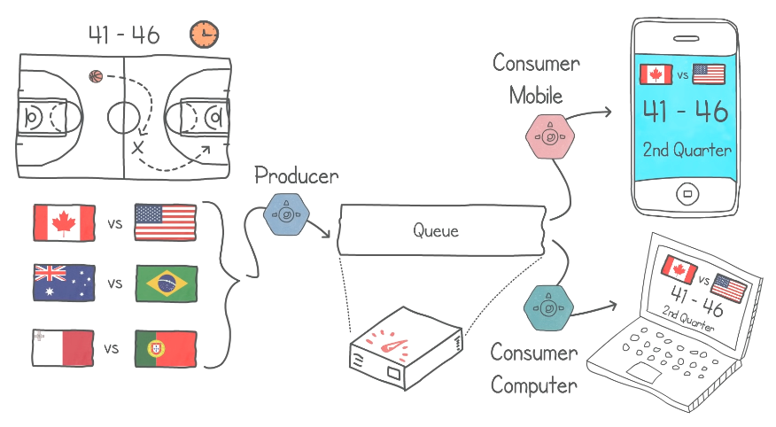
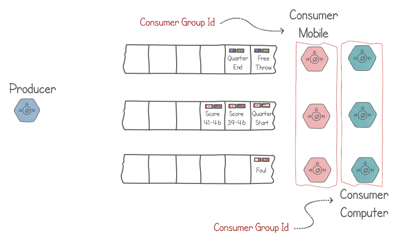
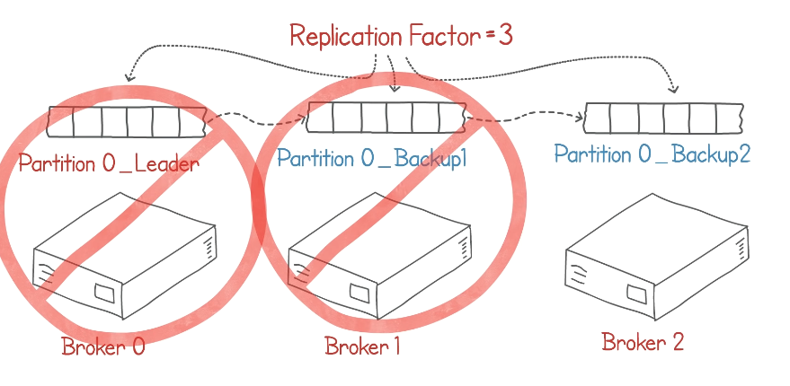

## Apache Kafka

- [Course Link](https://www.youtube.com/watch?v=Ch5VhJzaoaI)

## Apache Kafka Overview

### Producer and Consumer Interaction

- **Producer** feeds data into Kafka Queue.
- **Consumers** (mobile or web) retrieve data from the Kafka Queue.

### Issue: 1 Queue --> High Volumes and Queue Overload

- When there is only 1 queue, the server is overloaded due to increased data volumes.
- The queue is unable to handle the incoming data.
- **Solution: Distributing Contents**
  - Distribute data into **multiple queues** to manage high volumes.
  - Risk: Potential inconsistency in data order for consumers.
- **Distribution Strategies**
  - Application can define item distribution in queues (e.g., grouping items in the same queue).
  - Each queue becomes a _partition_; the count of items in a partition is the _partition count_.

### Kafka Terminologies

- _Partition_: Queue holding data, managed by a broker.
- _Broker_: Server holding 1 or more partitions.
- _Record_: Individual data item within a partition.
- _Partition Key_: Field deciding the partition for a record.
- _Topic_: Group of partitions managing similar data types.

### Record Identification

- Each record in a topic is identified by offset (sequential number) and partition number.

### Consumer Applications

- Parallelizing consumer applications for scalability.
- One consumer per partition ensures ordering.
- Consumers are lightweight, many can be created without performance impact.

### Consumer Groups

- Consumers in the same group don't share partitions.
- Different consumer groups (mobile or web) for distinct applications reading the same data.
- Each consumer group maintains separate offset pointers for tracking read records.

### Retention Policies

- Kafka Cleanup Policies
  - **Retention Policy**: Deletes records after a set time (e.g., 24 hours).

### Data Storage and Fault Tolerance

- Records stored in fault-tolerant, durable persistent storage.
- Replication of partitions ensures fault tolerance.
- **Replication Factor**: Configured to create backup partitions (leader and backups).
- _Tolerance_: Can handle multiple broker failures with a specified replication factor.
  - E.g., Replication factor of 3 means 3 copies of partition (1 leader and 2 backups), can tolerate up to 2 brokers going down at the same time.
